---

# Video Action Recognition using LS-ViT 

Dự án này triển khai mô hình **LS-ViT (Long-Short Term Video Transformer)** để giải quyết bài toán phân loại hành động trong video (Video Action Recognition). Khác với các phương pháp CNN truyền thống hay ViT cơ bản, LS-ViT được thiết kế để xử lý hiệu quả cả đặc trưng không gian (Spatial) và sự phụ thuộc thời gian (Temporal) trong chuỗi khung hình.

## Tổng quan (Overview)

Phân loại video đặt ra thách thức lớn do dữ liệu chứa chiều thời gian, nơi các hành động diễn ra liên tục. Các mô hình Vision Transformer (ViT) truyền thống thường chỉ xử lý từng khung hình riêng lẻ và gộp trung bình, làm mất đi thông tin thứ tự hành động.
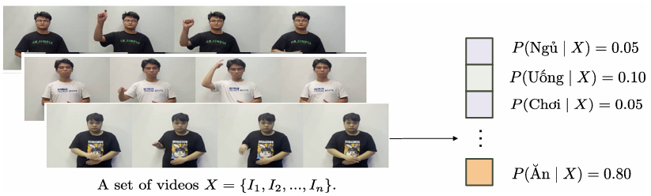

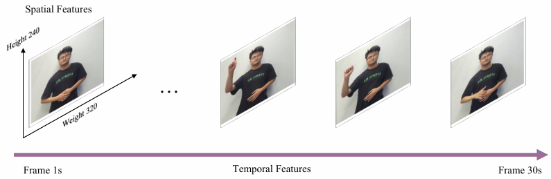

LS-ViT giải quyết vấn đề này bằng cách tích hợp hai module chuyên biệt:

1. **SMIF (Spatial-Motion Interaction Fusion):** Nắm bắt chuyển động ngắn hạn (short-term motion).


2. **LMI (Long-term Motion Interaction):** Mô hình hóa sự phụ thuộc dài hạn giữa các khung hình.


## Bộ dữ liệu (Dataset)

Dự án sử dụng bộ dữ liệu **HMDB51**, bao gồm 51 lớp hành động khác nhau (như cười, nhai, đấu kiếm, v.v.) được thu thập từ phim ảnh và video công cộng.

* **Đặc điểm:** Dữ liệu có sự đa dạng lớn về góc quay và điều kiện ánh sáng, đồng thời bị mất cân bằng (imbalance) số lượng video giữa các lớp.


* **Phân tích dữ liệu (EDA):** Các chỉ số về độ sáng, độ tương phản và phân bố frame được phân tích kỹ lưỡng trước khi huấn luyện.

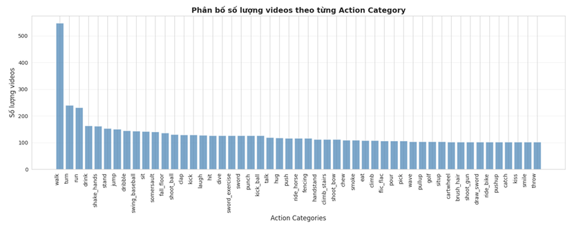

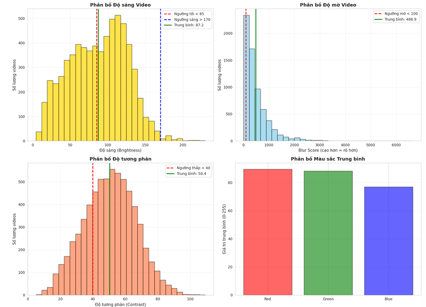

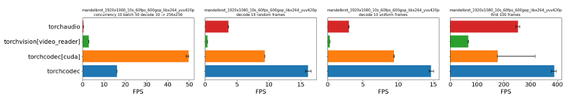

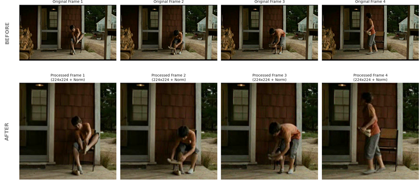
## Kiến trúc mô hình (Architecture)

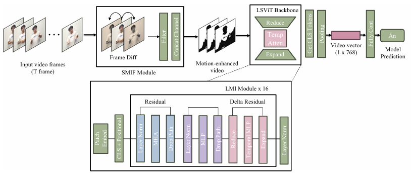

### 1. SMIF Module (Spatial-Motion Interaction Fusion)

Module này tính toán sự sai biệt (difference) giữa khung hình hiện tại và các khung hình lân cận để tạo ra "bản đồ chuyển động" (motion map), giúp mô hình tập trung vào các vùng có hành động.

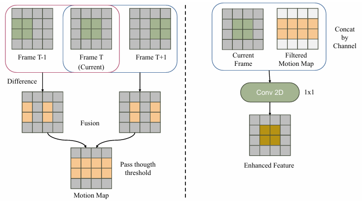

### 2. LMI Module (Long-term Motion Interaction)

Được tích hợp trong các khối Transformer, LMI sử dụng cơ chế attention để liên kết thông tin qua nhiều khung hình, giúp mô hình hiểu được ngữ cảnh toàn cục của video.

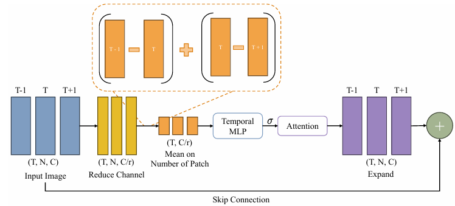

### 3. Các kỹ thuật khác

* **Patch Embedding:** Chuyển đổi video thành chuỗi vector tokens.


* **DropPath (Stochastic Depth):** Kỹ thuật regularization ngắt ngẫu nhiên các luồng dữ liệu để giảm overfitting.


## Cài đặt (Installation)

1. **Clone repository:**
```bash
git clone https://github.com/pahmlam/action_recognition.git
cd action_recognition

```

2. **Cài đặt thư viện:**
```bash
pip install -r requirements.txt

```

Lưu ý: Dự án khuyến nghị sử dụng `torchcodec` để tăng tốc độ decode video trên GPU.

## Huấn luyện & Sử dụng (Training & Usage)

### 1. Xử lý dữ liệu (Data Pipeline)

Dữ liệu được xử lý thông qua `HMDB51Dataset` với các kỹ thuật:

* **Uniform Sampling:** Lấy mẫu frame cách đều nhau.

* **Temporal Padding:** Lặp lại frame cuối nếu video quá ngắn.

* **Augmentation:** Random Crop, Horizontal Flip, Color Jitter .

### 2. Chạy huấn luyện

Chạy file `train.py` để bắt đầu quá trình huấn luyện:

```bash
python train.py

```

### 3. Phân tích dữ liệu (EDA)

Để xem các biểu đồ phân tích dữ liệu và trực quan hóa frame:

```bash
jupyter notebook eda.ipynb

```

## Kết quả (Results)

Sau quá trình huấn luyện với CrossEntropyLoss và AdamW optimizer, mô hình được đánh giá trên tập validation/test.

### Biểu đồ Loss & Accuracy

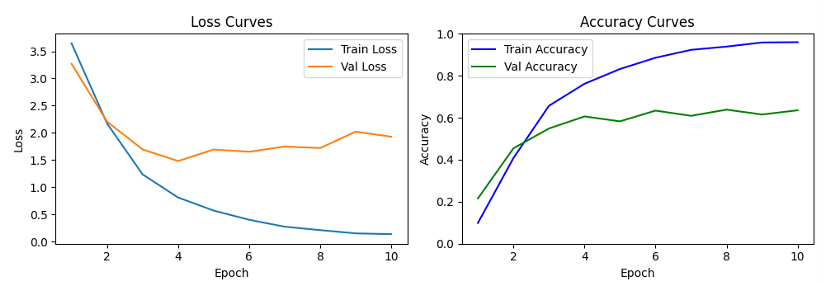

### Dự đoán thực tế (Demo)

Dưới đây là kết quả dự đoán của mô hình trên một video mẫu từ tập kiểm thử:

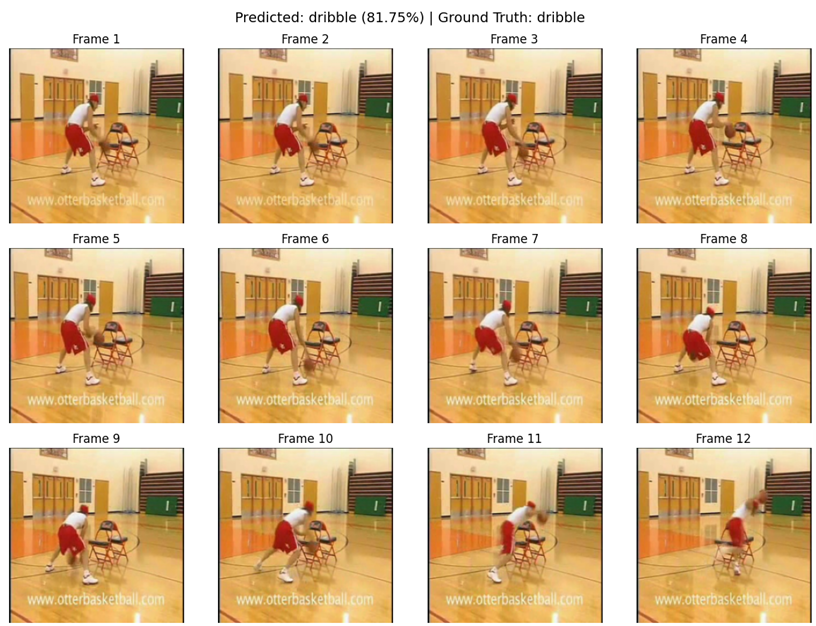

## Cấu trúc dự án (Project Structure)

```text
action_recognition/
├── data/hmdb51/            # Dữ liệu dataset
├── src/
│   ├── config.py           # Cấu hình Hyperparameters
│   ├── dataset.py          # Class HMDB51Dataset & Transform
│   ├── modules.py          # PatchEmbed, Attention, DropPath
│   └── ls_vit.py           # SMIF, LMI, LSViTBackbone, Model Head
├── train.py                # Script huấn luyện chính
├── eda.ipynb               # Notebook phân tích dữ liệu
├── requirements.txt        # Các thư viện cần thiết
└── README.md               # Tài liệu dự án

```

## Tham khảo (References)

* **Dataset:** HMDB51 - Serre Lab, Brown University.

---
